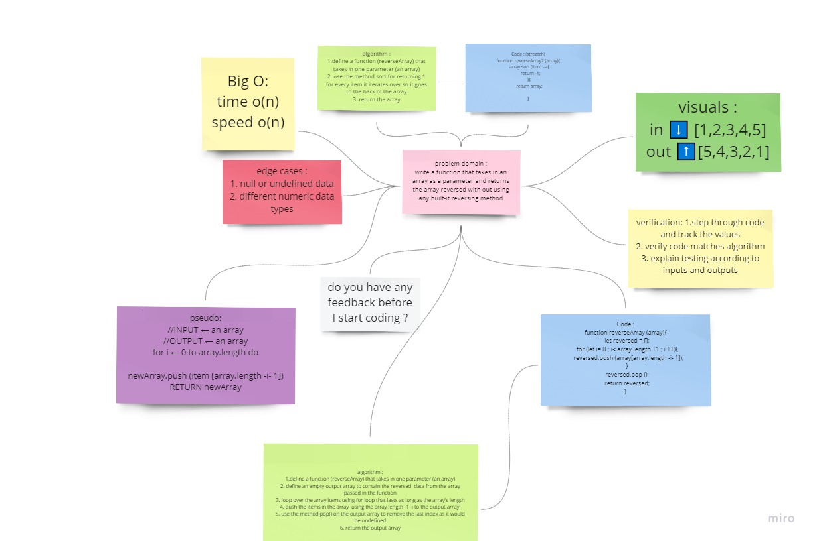

# Reverse an Array
a function that takes an array as an argument. Without utilizing any of the built-in methods available to your language, return an array with elements in reversed order

## Whiteboard Process

for more clear image see it more clear [click here](https://miro.com/app/board/o9J_lEVSL0U=/)

## Approach & Efficiency
used two ways , one by using sort () to resort an array reversed and the other by a simple for loop that pushes into a new array according to index from last to first . 