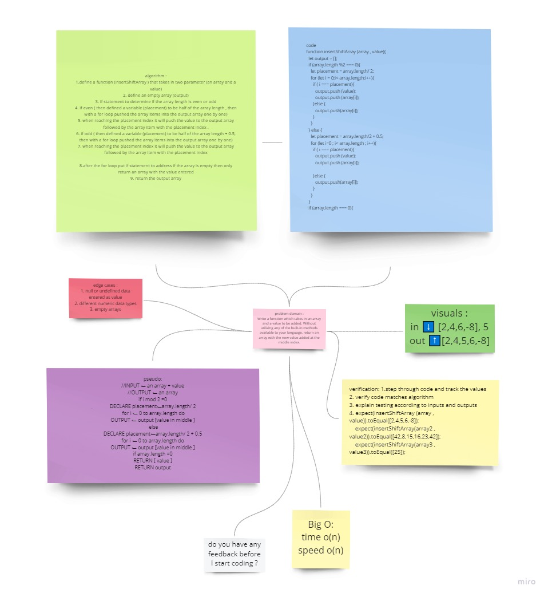

# array-shift
a function that takes in an array and a value to be added. Without utilizing any of the built-in methods available to your language, return an array with the new value added at the middle index.

## Whiteboard Process

for more clear image see it more clear [click here](https://miro.com/app/board/o9J_lDmmlWQ=/)

## Approach & Efficiency
with an if statement decided weather the array length is even or odd , then accordingly to that decided the index placement of the value provided to be put in ,then using a for loop iterated over the array pushing all previous items into an output array , when the index reached the same as the placement ,pushed the value then the array item into the output array , and after that returned the output array.