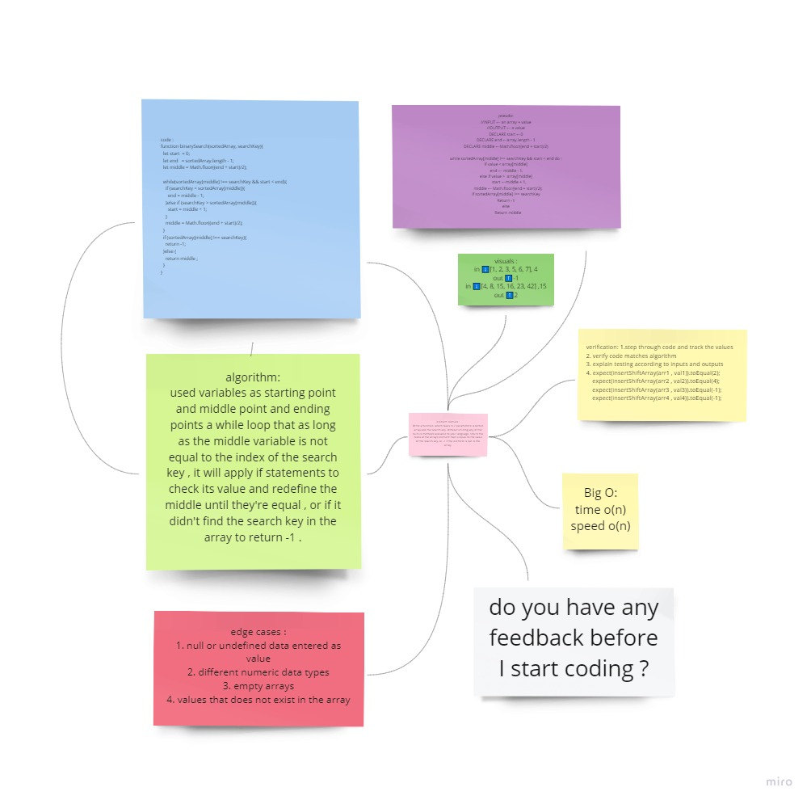

# Array binary search
a function that takes a sorted array and a search key as arguments. Without utilizing any of the built-in methods available to your language, return the index of the search key in the sorted array or -1 if it didn't exist in it .

## Whiteboard Process

for more clear image see it more clear [click here](https://miro.com/app/board/o9J_lD2igI0=/)

## Approach & Efficiency
used variables as starting point and middle point and ending points a while loop that as long as the middle variable is not equal to the index of the search key , it will apply if statements to check its value and redefine the middle until they're equal , or if it didn't find the search key in the array to return -1 .