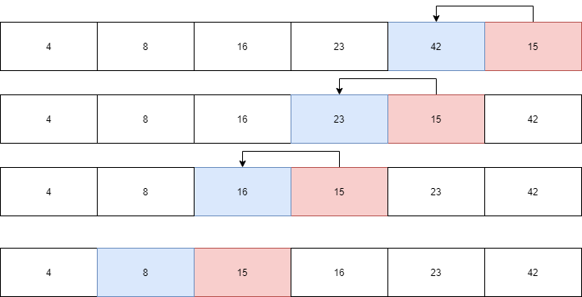

# Insertion Sort
Insertion sort is a simple sorting algorithm that works similar to the way you sort playing cards in your hands. The array is virtually split into a sorted and an unsorted part. Values from the unsorted part are picked and placed at the correct position in the sorted part.

## Pseudocode
```

 InsertionSort(int[] arr)
  
    FOR i = 1 to arr.length
    
      int j <-- i - 1
      int temp <-- arr[i]
      
      WHILE j >= 0 AND temp < arr[j]
        arr[j + 1] <-- arr[j]
        j <-- j - 1
        
      arr[j + 1] <-- temp

```
## Trace
Sample Array: [8,4,23,42,16,15]
<!-- function insertionSort (arr){
  for (let i =1 ; i < arr.length ; i ++){
    let j = i - 1;
    let temp = arr[i];
    while (j >= 0 && temp < arr[j]){
      arr[j+1] = arr[j];
      j = j -1;
    }
    arr[j+1] = temp;
  }
  return arr;
} -->

### Pass 1:

In the first pass through of the insertion sort, we make the first number our starting point that we are going to sort other numbers comparing to
* i =1
* j = 0
* temp  = 8


### Pass 2:

In the second pass ,we compare the second number to the previous temp we had , since it is less we are going to move it 
* i =2
* j = 1
* temp  = 4


### Pass 3:

In the third pass ,we compare the third number to the previous temp we had 8, since it is larger it stays 
* i =3
* j = 2
* temp  = 23


### Pass 4:

In the fourth pass ,we compare the fourth number to the previous temp we had 23, since it is larger it stays 
* i = 4
* j = 3
* temp  = 42


### Pass 5:

In the fifth pass ,we compare the fifth number to the previous temp we had 42, since it is less it should be moved to the left each time comparing with the previous value until the previous value is no longer larger. 
* i = 5
* j = 4
* temp  = 16


### Pass 6:

In the fourth pass ,we compare the fourth number to the previous temp we had 8, since it is larger it stays 
* i = 6
* j = 5
* temp  = 15



### last result 


## Efficency
### Time: O(n^2)
The basic operation of this algorithm is comparison. This will happen n * (n-1) number of times…concluding the algorithm to be n squared.
### Space: O(1)
No additional space is being created. This array is being sorted in place…keeping the space at constant O(1).