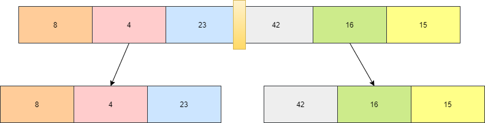
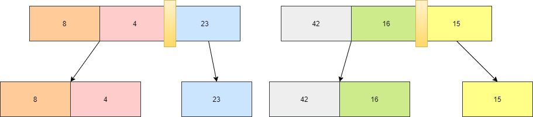
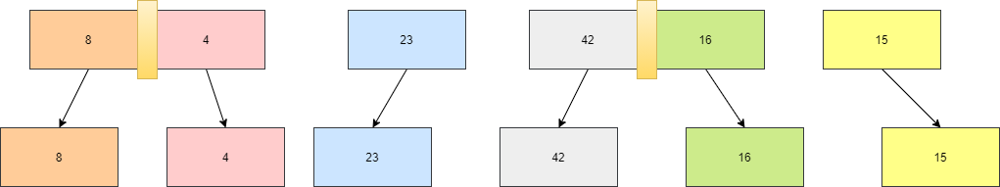
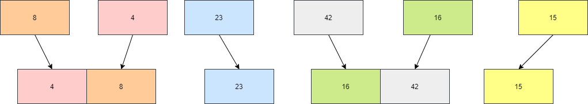
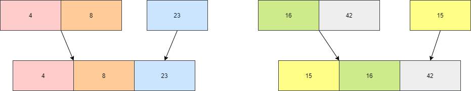
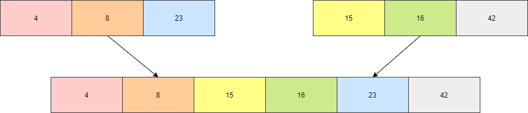
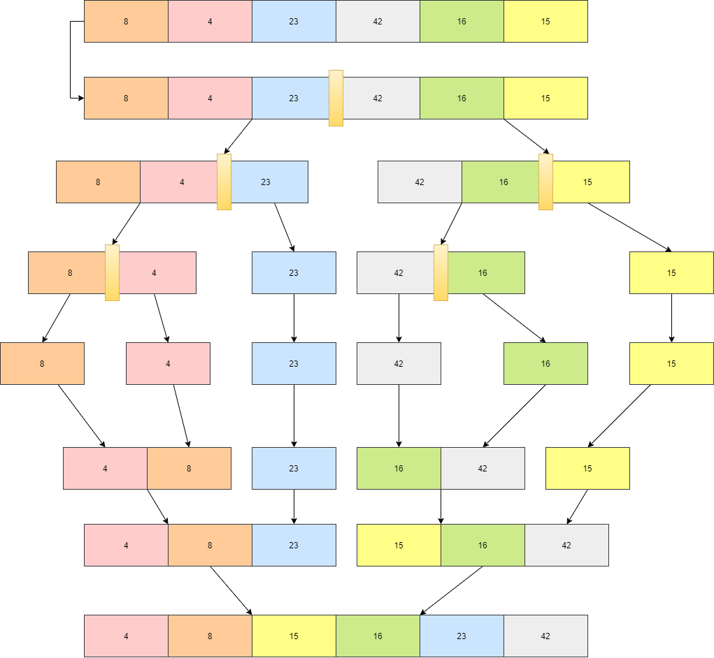

# Merge Sort
Merge Sort : works on the principle of Divide and Conquer. Merge sort repeatedly breaks down a list into several sub lists until each sublist consists of a single element and merging those sublists in a manner that results into a sorted list.

## Pseudocode
```

 InsertionSort(int[] arr)
  
 
ALGORITHM Mergesort(arr)
    DECLARE n <-- arr.length
           
    if n > 1
      DECLARE mid <-- n/2
      DECLARE left <-- arr[0...mid]
      DECLARE right <-- arr[mid...n]
      // sort the left side
      Mergesort(left)
      // sort the right side
      Mergesort(right)
      // merge the sorted left and right sides together
      Merge(left, right, arr)

ALGORITHM Merge(left, right, arr)
    DECLARE i <-- 0
    DECLARE j <-- 0
    DECLARE k <-- 0

    while i < left.length && j < right.length
        if left[i] <= right[j]
            arr[k] <-- left[i]
            i <-- i + 1
        else
            arr[k] <-- right[j]
            j <-- j + 1
            
        k <-- k + 1

    if i = left.length
       set remaining entries in arr to remaining values in right
    else
       set remaining entries in arr to remaining values in left


```
## Trace
Sample Array: [8,4,23,42,16,15]

### Pass 1:
divide the array  [8,4,23,42,16,15] to two half's 




### Pass 2:
divide the two arrays  [8,4,23],[42,16,15] to two half's each




### Pass 3:
divide the two arrays with more then one value   [8,4],[42,16] to two half's each again



### Pass 4:
combine the two arrays that were separated last in a sorted manner




### Pass 5:
combine the two arrays that resulted from the previous step with the two arrays that were separated first in a sorted manner




### Pass 6:
combine the two arrays that resulted from the previous step with in a sorted manner




### last result 


## Efficency
### Time: O(n log n)
recursive functions along side with more then one while loop but it takes less time then other sorting methods
### Space: O(n)
additional space is being created. the array is being sorted with a space at  O(n).