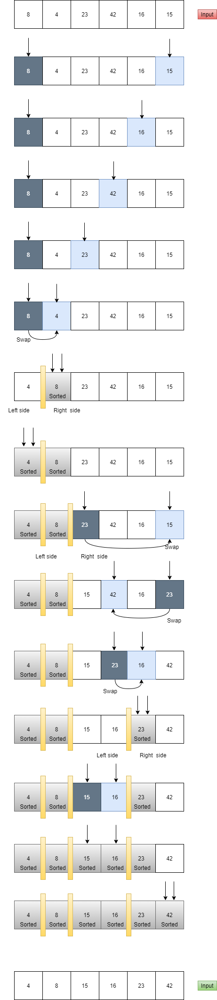

# Quick Sort
Quicksort :  is a divide-and-conquer algorithm. It works by selecting a 'pivot' element from the array and partitioning the other elements into two sub-arrays, according to whether they are less than or greater than the pivot. For this reason, it is sometimes called partition-exchange sort.
## Pseudocode
```

 ALGORITHM QuickSort(arr, left, right)
    if left < right
        // Partition the array by setting the position of the pivot value 
        DEFINE position <-- Partition(arr, left, right)
        // Sort the left
        QuickSort(arr, left, position - 1)
        // Sort the right
        QuickSort(arr, position + 1, right)

ALGORITHM Partition(arr, left, right)
    // set a pivot value as a point of reference
    DEFINE pivot <-- arr[right]
    // create a variable to track the largest index of numbers lower than the defined pivot
    DEFINE low <-- left - 1
    for i <- left to right do
        if arr[i] <= pivot
            low++
            Swap(arr, i, low)

     // place the value of the pivot location in the middle.
     // all numbers smaller than the pivot are on the left, larger on the right. 
     Swap(arr, right, low + 1)
    // return the pivot index point
     return low + 1

ALGORITHM Swap(arr, i, low)
    DEFINE temp;
    temp <-- arr[i]
    arr[i] <-- arr[low]
    arr[low] <-- temp

```
## Trace
Sample Array: [8,4,23,42,16,15]

### Pass 1:
we set the pivot to be the first element of the array (8)
left pointer represents the first element index 0 (8) and the right pointer represents the last element  index array length - 1 (15)

### Pass 2:
start by moving the right pointer backwards and comparing the pivot value with the value that the right pointer is pointing at which is (15) since 8 is less then (15), move the right pointer backwards again 


### Pass 3:
keep moving the right pointer backwards and comparing the pivot value with the value that the right pointer is pointing at until it reaches a value that is more then the pivot (8), swap the pivot with the value (4)and now move the other pointer (the left) forwards 


### Pass 4:
now the (8) is sorted in the right place and we have two sub arrays , we start sorting from the left sub array , since it is only one value (4) , (4) now is sorted .


### Pass 5:
now we have [23,42,16,15] left to sort , the pivot here is 23 and the left is pointing on the 23 and the right on 15 , compare 23 with 15 and swap them [15,42,16,23], and move the left pointer forwards and compare (23) and (42) and swap them [15,23,16,42] , move the right pointer backwards and compare (23) and (16) and swap them [15,16,23,42] now we have two sub arrays [15,16] and [23,42] 


### last result 
the two sub arrays are by chance sorted so the final result is [4,8,15,16,23,42]




## Efficiency
### Time: O(n log n)
recursive functions along side with more then one while loop but it takes less time then other sorting methods
### Space: O(1)
No additional space is being created. This array is being sorted in place…keeping the space at constant O(1).